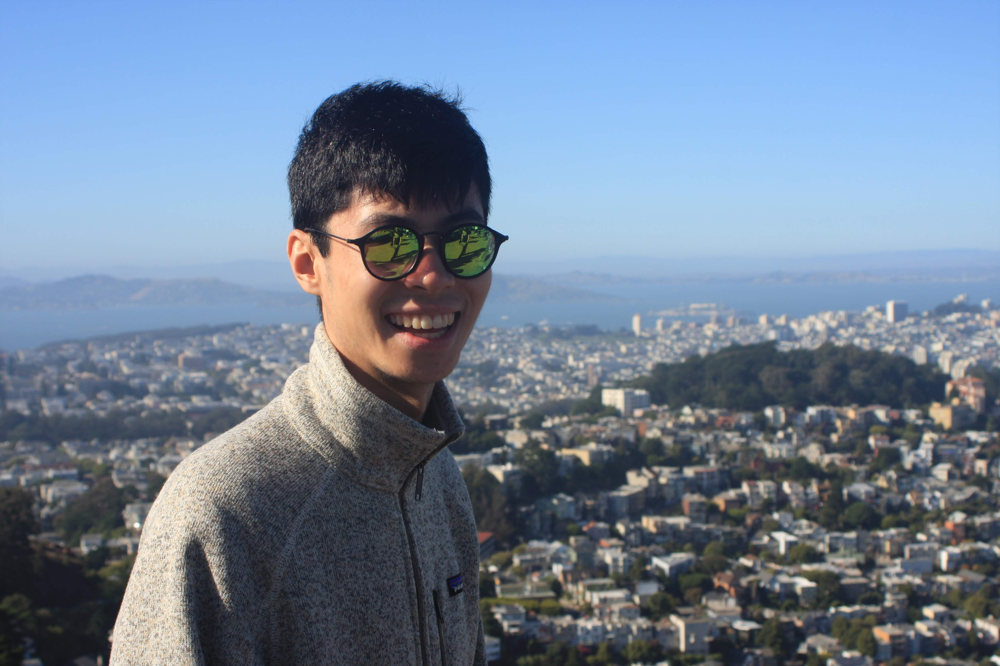

### Hi there 👋

<!--
**zhangj150/zhangj150** is a ✨ _special_ ✨ repository because its `README.md` (this file) appears on your GitHub profile.

Here are some ideas to get you started:

- 🔭 I’m currently working on ...
- 🌱 I’m currently learning ...
- 👯 I’m looking to collaborate on ...
- 🤔 I’m looking for help with ...
- 💬 Ask me about ...
- 📫 How to reach me: ...
- 😄 Pronouns: ...
- ⚡ Fun fact: ...
-->

Whether it's coding or auto-racing, I love to tinker, optimize, and push the boundaries of what is possible.

Backend Software Engineer based in California

Aspiring [Grandmaster Chess Puzzle Solver](https://lichess.org/@/zhangj150)

Race Kart Driver
